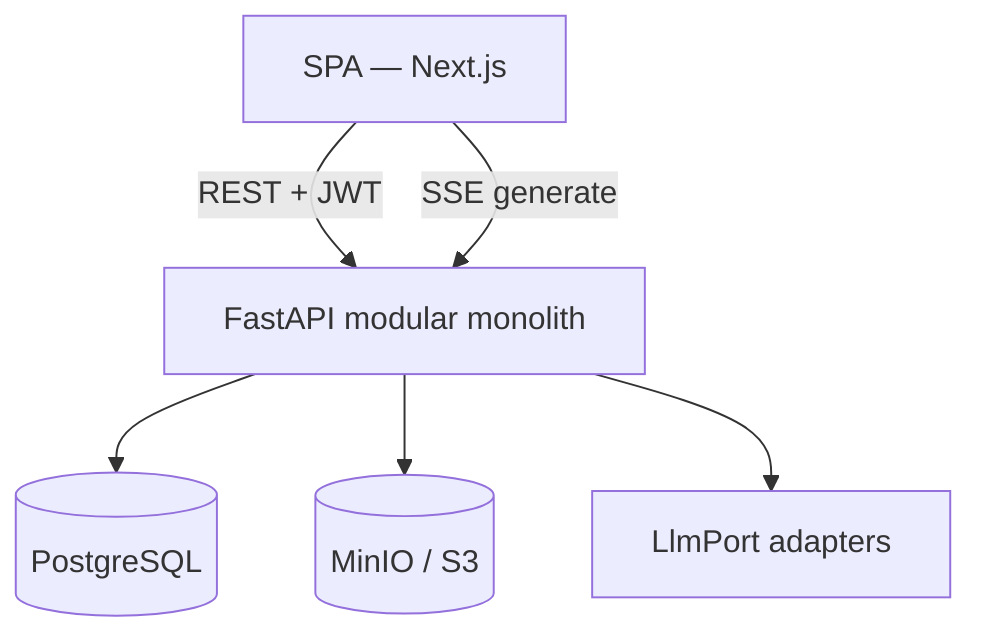
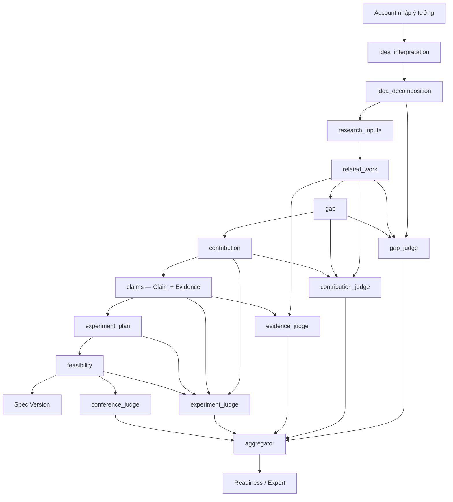
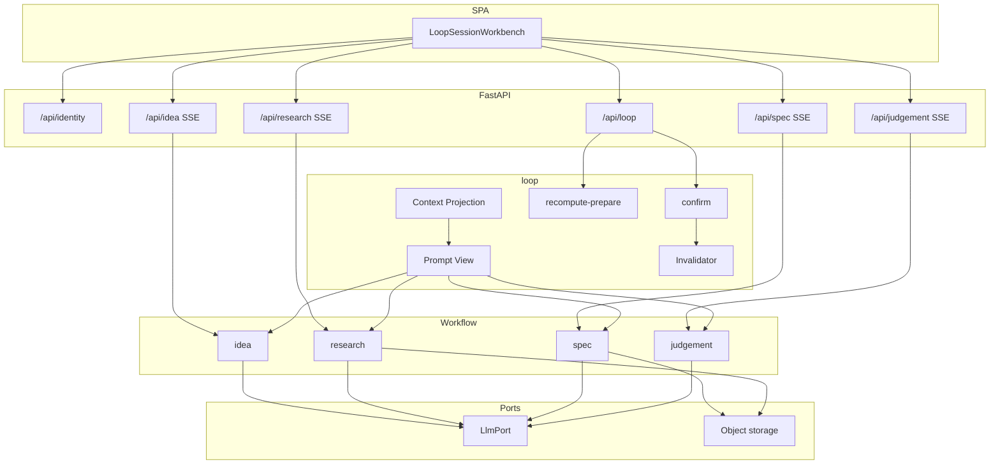

# Tài Liệu Kiến Trúc (Architecture Document)

## 1. Tổng quan hệ thống (System Overview)

SPECRESEARCH LOOP chuyển một ý tưởng nghiên cứu mơ hồ thành **Research Spec** đã được Account xác nhận, qua workflow human-in-the-loop (grilling → related work → gap → contribution → claims/evidence → experiment plan → Independent Judges → Readiness). Hệ thống đánh giá **Readiness** của Spec; nó không cam kết hội nghị chấp nhận bài.

Kiến trúc ngày một: **Modular Monolith** (một process FastAPI) + **SPA** (Next.js App Router). Domain và orchestration sống trên backend; trình duyệt chỉ là client OpenAPI/SSE.

- **Backend:** FastAPI (Python). REST cho lệnh/đọc; Server-Sent Events (SSE) trong request cho generate dài (grilling, research, spec, judges).
- **Frontend:** Next.js (SPA), React, Tailwind CSS, shadcn/ui. Client REST sinh từ OpenAPI bằng Orval + TanStack Query; SSE viết tay (`frontend/lib/api/sse.ts`).
- **PostgreSQL:** trạng thái quan hệ — Account, Loop Session, Card, Decision, Stage Revision, Spec Version, hàng typed của từng module.
- **MinIO (S3-compatible):** Spec Artifact, nguồn văn bản scholarly (PDF/HTML đã chuẩn hóa), object lớn khác. Postgres giữ object key, không nhét blob vào BYTEA.
- **LLM:** module workflow phụ thuộc `LlmPort`; vendor/model là adapter (`app/adapters/llm`). Mỗi Workflow Node có thể bind profile/model khác nhau. Verifier rule-based chạy cạnh LLM, không thay Judge.

## 2. Cấu trúc Backend (6 module)

Một process FastAPI; mỗi module sở hữu HTTP API, service và model dưới `backend/app/modules/<name>/`. Shared: `core`, `db`, `ports`, `adapters`. `loop` không import bảng của `idea` / `research` / `spec` / `judgement` — freeze, reset-working và Context Projection đi qua `StagePort` (`app/ports/`). `main.py` bind từng Workflow Node tới port.

| Module | Prefix | Vai trò |
|--------|--------|---------|
| **identity** | `/api/identity` | Account, email/password, JWT Bearer |
| **loop** | `/api/loop` | Loop Session, Card, Decision, Working Draft, Stage Revision, invalidation, Context Projection, Prompt View, Spec Artifact / Export Scratch |
| **idea** | `/api/idea` | Generate/SSE grilling: interpretation (Idea Frame + Grilling Questions) rồi decomposition (Cards) |
| **research** | `/api/research` | Generate/SSE: research inputs, related work, gap; citation, passage grounding, nguồn (OpenAlex / Semantic Scholar / upload) |
| **spec** | `/api/spec` | Generate/SSE: contribution, claims+evidence, experiment plan, feasibility; mint Spec Version khi Confirm feasibility |
| **judgement** | `/api/judgement` | Generate/SSE: năm Judge độc lập + Aggregator (compose report, không phải Judge thứ sáu) |

Quy tắc cắt ngang (ADR 0012): **generate/SSE trên module workflow**; **confirm, history, recompute-prepare trên `loop`**. `loop.confirm` là một transaction in-process: freeze → mint Stage Revision → so với Node Head → đánh Stale descendant nếu nội dung đổi → append Decision. Confirm feasibility đồng thời mint Spec Version.

### 2.1 Persistence lai

- **loop** giữ JSONB narrative trên Working Draft / Stage Revision và con trỏ Node Head (`empty` | `current` | `stale`).
- Module workflow giữ hàng typed (Citation, Judge Run, …). Hàng `stage_revision_id = NULL` là working; Confirm clone sang revision bất biến.
- Context Projection lắp Stage Revision **current** (không đọc Stale) + Working Draft của node đang sửa. LLM **không** nhận nguyên Projection.

### 2.2 Prompt View (ADR 0035)

Mỗi lần gọi LLM, `loop.prompt_view` cắt Projection thành JSON theo Workflow Node: Card đã slim, gap, related-work compact hoặc passage có `source` (title, year, venue, `verification_status`). Không dump grilling transcript, abstract/PDF, object key, checksum, hay Judge Run của peer. Chi tiết slice: [prompts.md](prompts.md).

## 3. Kiến trúc Frontend

SPA gọi FastAPI trực tiếp (`NEXT_PUBLIC_API_BASE_URL`). Phân rã theo `frontend/features/`, khớp module backend:

- `features/identity` — đăng ký / đăng nhập.
- `features/loop` — danh sách Loop Session, Workbench, Node Head, Working Draft, Spec Draft (`ProducedSpecVersionView`), Decision history.
- `features/idea` — Grilling Workspace (Idea Frame, cụm câu hỏi, Account note).
- `features/research` — research inputs, Related Work matrix, Gap Candidate Picker, contribution directions.
- `features/spec` — Claims/Evidence (cùng node `claims`), Experiment Plan, Feasibility.
- `features/judgement` — dashboard Independent Judges (5 Judge Head compact + Aggregator Report), Readiness, Export Scratch markdown.

Loop Stage trên UI: Grilling → Related work → Gap → Contribution → Claims/evidence → Experiment planning → Spec Draft → Independent judges → Readiness. **Spec Draft** và **Readiness** không có Workflow Node; Confirm feasibility mint Spec Version mà Account đọc ở Spec Draft. Independent judges là **một dashboard**, không phải sáu màn hình.

## 4. Luồng dữ liệu chính (SpecResearch Loop)

1. **Grilling.** Account gửi ý tưởng; `idea` stream interpretation. Confirm Idea Frame (intent, problem, research_question) rồi decomposition thành Cards. Confirm từng Workflow Node trên `loop`.
2. **Related work & Gap.** `research` parse nguồn, trích passage, grounding (`GROUNDED` / `WARNING` / `REJECTED` bằng đối chiếu chuỗi với `source_text`). Account xác nhận related work rồi gap.
3. **Spec Construction.** `spec` sinh contribution (có thể chọn direction), Claim + Evidence Cards trên `claims`, experiment plan, feasibility. Confirm feasibility → mint **Spec Version** (Valid khi chưa Stale).
4. **Independent Judges.** Năm Judge chạy độc lập trên Prompt View riêng + verifier (Gap: `gap_unsupported_by_sources`; Evidence: `unsupported_citation`). Generate Judge thành công = Confirm Judge (kể cả khi Working Draft đang ở Aggregator). Khi năm head current, Aggregator **compose** Issues/Severity/Grounds từ Judge Run, trồng Handling Option từ catalog, rồi LLM chỉ **diễn đạt** option cho CRITICAL/MAJOR.
5. **Readiness & xuất.** Readiness fail nếu Aggregator Report còn CRITICAL. Account PICK Handling Option → reopen node đích (suggested patch trên Working Draft, không sửa Spec Version tại chỗ). Spec Artifact / Export Scratch không bị CRITICAL chặn; mỗi lần tải khi còn CRITICAL cần **Critical Export Confirmation**.

Generate: SPA → SSE trên module → Working Draft. Confirm: SPA → `POST /api/loop/.../confirm` → Stage Revision bất biến. Reopen / PICK đánh Stale downstream theo DAG; history không xóa.

## 5. Sơ đồ kiến trúc runtime

