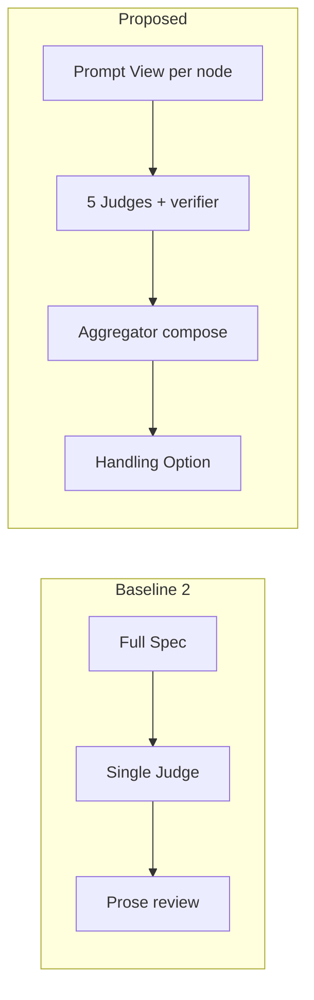

# System Evaluation

## 1. Mục tiêu

Báo cáo này đánh giá SPECRESEARCH LOOP trên ba lớp — không dùng một score “conference acceptance”:

1. **Cơ chế** — passage grounding, rule-based verifier, 5 Independent Judges, Aggregator compose (không majority vote).
2. **Baseline** — one-shot Spec generation, và một LLM đóng vai Single Judge.
3. **End-to-end** — ý tưởng mơ hồ → Research Spec mà Account Confirm / export được.

Hệ thống chấm **Readiness** của Valid Spec Version: CRITICAL trên Aggregator Report → fail. Conference Judge chỉ emit criterion scores; scores đó **không** tự fail Readiness.

## 2. Điểm cần chứng minh

1. **5 Independent Judges + Prompt View.** Mỗi Judge nhận một slice theo Workflow Node (`loop/prompt_view.py`), không dump cả Spec. Aggregator không phải Judge thứ sáu: code compose Issues / Severity / Grounds; LLM chỉ phrase Handling Options cho CRITICAL/MAJOR ([prompts.md](prompts.md), [architecture.md](architecture.md)).
2. **Passage-level grounding + verifier.** Related work so `passage` với `source_text` (`GROUNDED` / `WARNING` / `REJECTED`). Evidence Judge gọi `unsupported_citation(view)` trên cùng Prompt View; LLM **không được drop** Issue mà verifier đã emit. Floor của `unsupported_citation` là **CRITICAL**.
3. **Claim và Evidence cùng Workflow Node `claims`.** Confirm cần ít nhất một Claim và một Evidence không rỗng. Citation không phải Card.

## 3. Experimental setup

### 3.1 Task

Use case chính ([usecases.test.md](usecases.test.md)):

> “Tôi muốn xây dựng phương pháp tự động tối ưu promp nhiều vòng để giảm halluciation khi LLM trích xuất thông tin từ papers.”

Spec mẫu: [research_spec_demo.md](research_spec_demo.md).

### 3.2 Baselines

| ID | Method | Nguồn | Dùng để |
|----|--------|--------|---------|
| B1 | Hand-crafted prompt, zero-shot / few-shot, một lần gọi LLM ra Spec | [baseline_01.md](baseline_01.md) | Spec không loop, không grounding code |
| B2 | Single Judge: một LLM đọc cả Spec với reviewer prompt chung | [baseline_02.md](baseline_02.md) | So với 5 Judges + closed Finding Kind catalog |
| **P** | SpecResearch Loop (generate theo node, Confirm, Judges, verifier) | Code + demo Spec | Proposed |

B2 dùng **một Spec cố tình gài lỗi** (contribution over-claim; experiment plan không có baseline). Đây là qualitative case study, không phải A/B trên nhiều Spec.

### 3.3 Metrics hệ thống thực sự đo

Không invent “Unsupported Claim Rate %”. Metrics trong code:

| Metric | Cách đo | Hậu quả |
|--------|---------|---------|
| `GroundingStatus` | `passage.casefold() in source_text.casefold()` → GROUNDED; rỗng → REJECTED; còn lại WARNING | Finding không GROUNDED không được tính là grounded evidence |
| `unsupported_citation` | Mọi token của claim (dài > 3) phải nằm trong passage; không entail → Issue CRITICAL | Readiness `blocked` nếu Issue còn trên Aggregator Report |
| `gap_unsupported_by_sources` | Gap cite `citation_key` nhưng không có supporting passage | Floor CRITICAL |
| Closed Finding Kind | Catalog 8 kinds; tag lạ bị drop; LLM được **raise** Severity, không hạ dưới floor | `apply_floor` sau parse |
| Readiness | CRITICAL → fail; MAJOR/MINOR không fail; Conference scores không fail | Export Spec Artifact khi còn CRITICAL cần Critical Export Confirmation |
| Judge independence | Prompt cấm dùng Judge Run khác; Prompt View không chứa peer run | Test system prompt + merge verifier |

Repo **không log** thời gian Account Confirm Spec — không báo phút.

## 4. Results

### 4.1 Qualitative case study (B2 vs P)

Spec gài lỗi: contribution rộng hơn problem (SLM toán → “hết hallucination trên mọi LLM”); experiment chỉ “đo Accuracy/F1 trên GSM8K”, không baseline.

| | Single Judge (B2) | 5 Judges (P) |
|--|-------------------|--------------|
| Over-claim | Reviewer chung dễ khen structure, bỏ scope mismatch | Contribution Judge: `contribution_overclaimed` (floor MAJOR) |
| Experiment yếu | Góp ý kiểu “cần thêm hardware details” | Experiment Judge: `experiment_insufficient_for_claim` / `claim_broader_than_experiment` (floor MAJOR) |
| Fabricated citation | Không verifier; dễ pass nếu prose ổn | Evidence Judge + `unsupported_citation` CRITICAL; Grounds freeze claim + passage |
| Account action | Free-form comments | Handling Option catalog → PICK reopen gap / contribution / claims / experiment_plan |

Chi tiết: [baseline_02.md](baseline_02.md).



### 4.2 End-to-end (P, use case 1)

Từ ý tưởng gõ sai chính tả, Spec Draft mẫu có: Problem, RQ, Related Work, Gap, Contribution (`mechanism` / `gap_link` / `novelty` / `validation`), ba Claim kèm baseline / metric / rejection condition, Evidence, Experiment Plan, Constraints, required resources / bottlenecks / mitigations. File: [research_spec_demo.md](research_spec_demo.md).

Đây là **một** run minh họa, không phải trung bình trên N Spec.

### 4.3 Automated tests

Subset pytest cho grounding / verifier / compose (`backend/`, 03/09/2026):

```text
uv run pytest tests/test_judgement_verifiers.py \
  tests/test_judgement_issue_merge.py \
  tests/test_aggregator_composer.py \
  tests/test_judgement_prompts.py \
  tests/test_research_service.py::test_analysis_uses_research_context_and_separate_grounding_status \
  tests/test_research_service.py::test_grounded_abstract_citation_can_support_gap_candidate \
  tests/test_research_service.py::test_gap_claims_reject_model_invented_details_outside_grounded_candidates \
  tests/test_research_service.py::test_gap_claim_support_rejects_a_semantically_unrelated_passage \
  -q --tb=no

22 passed, 1 failed in 0.25s
```

**Pass (ví dụ):**

- `unsupported_citation` CRITICAL khi passage không entail claim; silent khi một passage entail; Grounds giữ `citation_key` cả khi passage rỗng.
- `gap_unsupported_by_sources` khi related work không có passage cho key đã cite.
- Merge: LLM không overwrite Grounds của verifier; không xóa verifier Issue.
- Composer: một CRITICAL `unsupported_citation` → `readiness == "blocked"`; **không** majority vote; Conference scores copy nguyên.
- Research: passage khớp abstract → GROUNDED; gap reject claim bịa ngoài grounded candidates; passage không liên quan bị reject.

**Fail còn mở:** `test_aggregator_system_is_phrasing_only_and_does_not_invent_other` — `_complete_llm` raise `Aggregator generate uses _run_aggregator`. Contract phrasing-only vẫn ở `_aggregator_system` và [prompts.md](prompts.md); test chưa đi đúng Aggregator generate path.

Backend có khoảng **400** `test_*` (loop, research, judgement, spec, export, LLM port). Frontend cover Workbench, Judges, Readiness, Claims.

### 4.4 So sánh (không dùng % giả)

| Method | Grounding code | Independent Judges | Verifier không drop | Readiness gắn CRITICAL |
|--------|----------------|--------------------|---------------------|------------------------|
| B1 one-shot | Không | Không | Không | Không |
| B2 Single Judge | Không | Không | Không | Không |
| **P** | Có (`_grounding_status`) | 5 nodes + Prompt View | Có (`merge_issues`) | Có (composer) |

Không có Pareto latency–quality: hệ thống không ghi Account latency. Trade-off: nhiều vòng generate/Confirm **chậm hơn** one-shot, đổi lấy typed Issues và Handling Options.

## 5. Limitations

- Chưa có thí nghiệm N lớn cho Unsupported Claim Rate hay Contradiction Rate.
- B2 là crafted Spec, không phải production LLM log trên cùng prompt.
- Demo Spec vẫn có thể chứa số do model generate; Judge/verifier mới là lớp chặn — Spec Draft không “sạch hallucination” sau một generate.
- Một Aggregator prompt test đang lệch path `_run_aggregator`.

## 6. Kết luận

- Tách Claim/Evidence và passage trong source cho phép audit bằng code (substring + token entail), không chỉ textual feedback.
- 5 Judges + Finding Kind catalog đặt tên riêng lỗi contribution và experiment; Aggregator không được majority-vote CRITICAL thành pass.
- Verifier + Severity floor là lớp cứng: LLM được phrase, không được xóa Grounds hay hạ dưới floor.
- So với B1/B2, evidence hiện có là **contract + tests + một e2e demo**, không phải bảng phần trăm giả.
